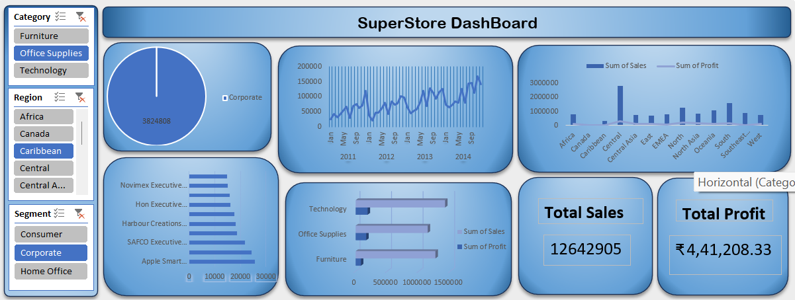

# Sales Performance Dashboard

## 📌 Project Overview

This project is an interactive Sales Performance Dashboard created using Microsoft Excel to analyze sales and profit performance. It provides clear insights into products, categories, regions, and customer segments.

## 🛠️ Tools Used

- Microsoft Excel
- Data Cleaning
- Data Analysis
- Pivot Tables
- Charts and Visualizations

## 🎯 Objectives

- Analyze overall sales and profit performance
- Identify top-performing products
- Compare sales across different regions
- Analyze category-wise performance
- Understand customer segment performance
- Identify important sales trends

## 📊 Key Analysis

- Total Sales
- Total Profit
- Sales by Category
- Sales by Region
- Sales by Product
- Customer Segment Analysis
- Sales Trends

## 📈 Dashboard Features

- Interactive dashboard
- KPI summary
- Charts and visualizations
- Category-wise analysis
- Region-wise analysis
- Product performance analysis
- Customer segment analysis

## 📷 Dashboard Preview

## 📁 Project Files

- `DashBoard.xlsx` – Excel dashboard
- `image.png` – Dashboard preview

## 🚀 How to Use

1. Download `DashBoard.xlsx`.
2. Open the file using Microsoft Excel.
3. Explore the dashboard and available visualizations.

## 👩‍💻 Author

Yazhini D
